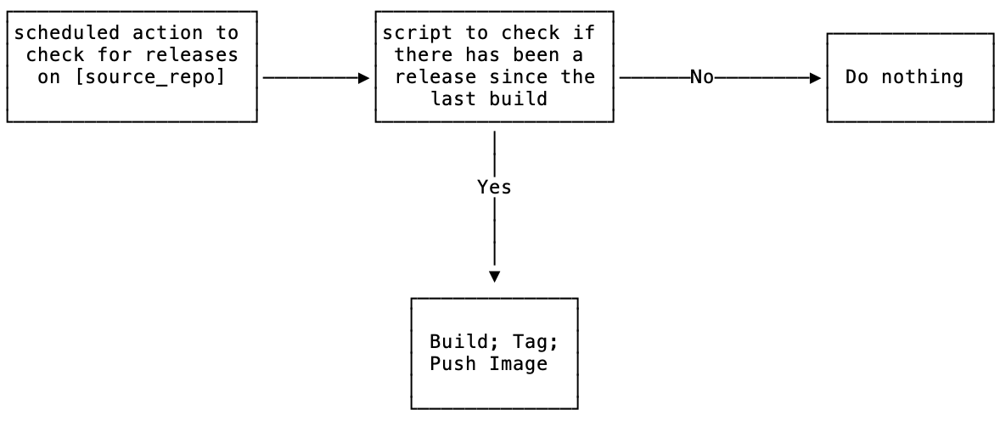

# TorchGeo Docker Build

This repository implements the follow workflow to build a release docker container whenever it detects a new release tag from the offical torchgeo repository

See [Publishing images to Docker Hub](https://docs.github.com/en/actions/publishing-packages/publishing-docker-images#publishing-images-to-docker-hub)

# Hello world docker action

This action prints "Hello World" or "Hello" + the name of a person to greet to the log.

## Inputs

## `who-to-greet`

**Required** The name of the person to greet. Default `"World"`.

## Outputs

## `time`

The time we greeted you.

## Example usage

uses: actions/hello-world-docker-action@v1
with:
  who-to-greet: 'Mona the Octocat'